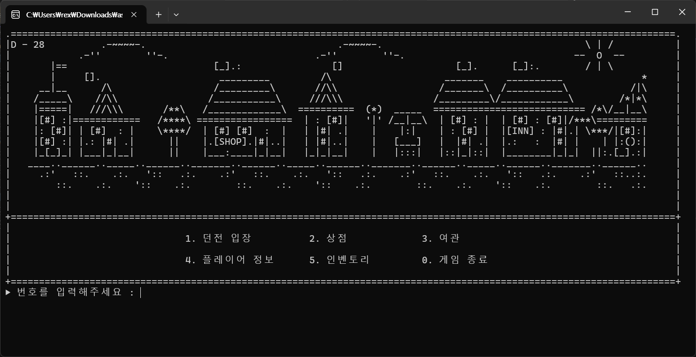
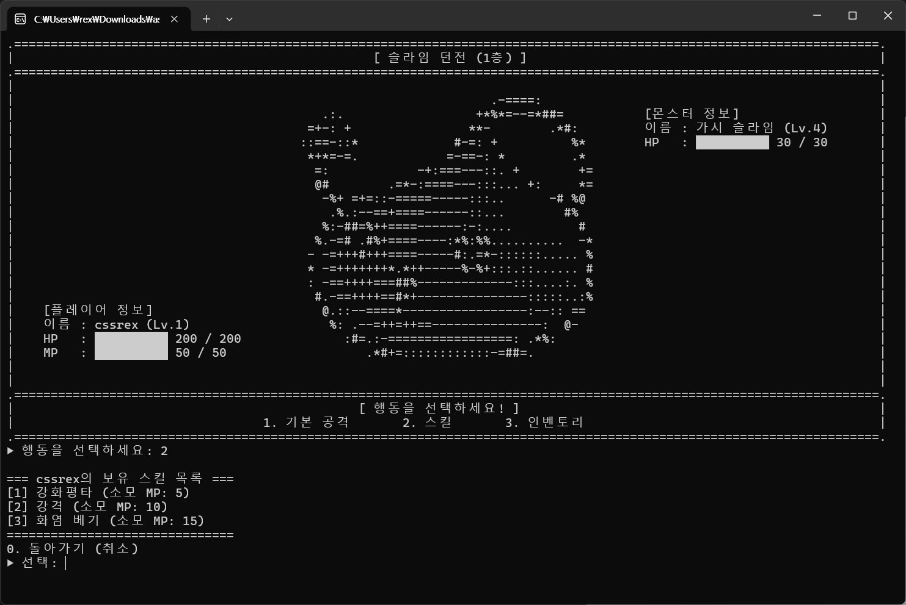
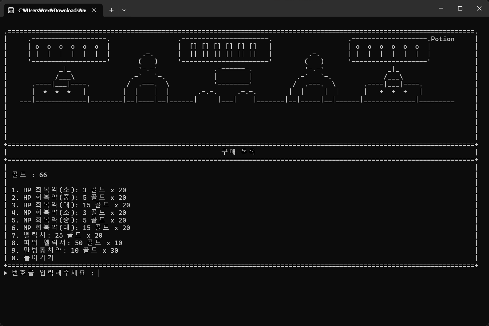
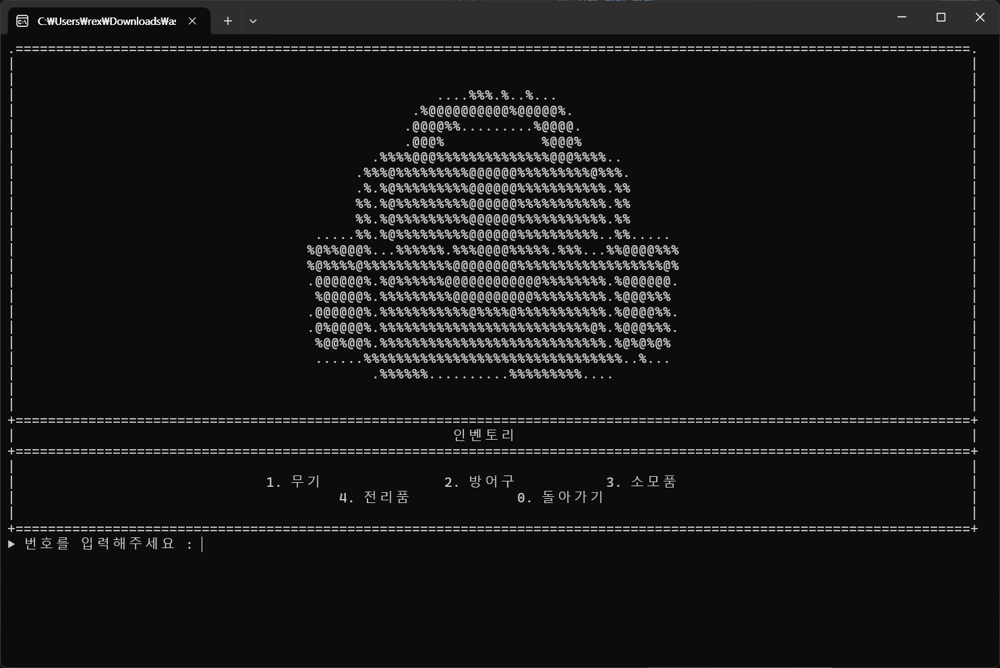
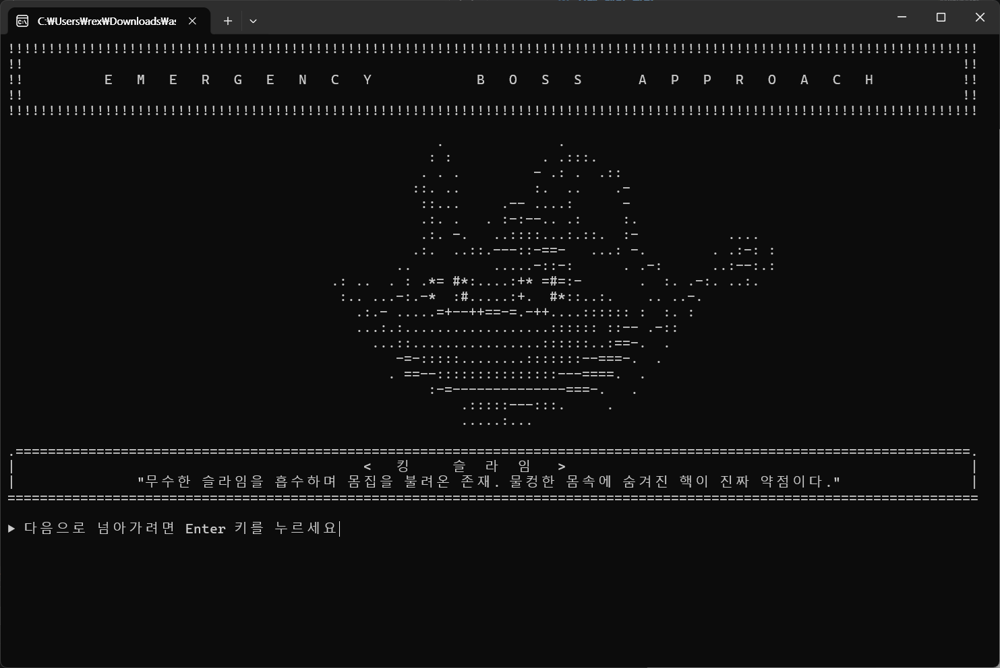

# 🎮 Text Console RPG

> **C++ 객체지향 프로그래밍을 활용하여 제작한 콘솔 기반 턴제 RPG**

---

# 📖 프로젝트 소개

**Text Console RPG**는 C++ 객체지향 프로그래밍을 학습하며 제작한 팀 프로젝트입니다.

플레이어는 모험가가 되어 **슬라임 → 고블린 → 오크 → 드래곤** 던전을 차례대로 공략하며 성장합니다.

플레이어에게는 **단 28일**이라는 시간이 주어집니다. 그 안에 최종 보스를 무찌르셔야 합니다.

단순한 텍스트 RPG가 아닌,

* 던전 시스템
* 턴제 전투
* 장비 시스템
* 상점
* 날짜 시스템
* ASCII Art
* BGM / SFX

등을 추가하여 콘솔에서도 RPG 특유의 재미와 몰입감을 느낄 수 있도록 개발했습니다.

---

# ✨ 주요 기능

**플레이어**   캐릭터를 생성하면 레벨업, 스킬 3종, 상태이상, 능력치 성장, 장비 착용까지 다 됩니다.

**몬스터**  슬라임 → 고블린 → 오크 → 드래곤(최종 보스) 순서로 등장합니다. 각각 스탯이랑 드랍 아이템이 다르고, 보스를 잡아야 다음 던전이 열립니다.

**전투**   턴제입니다. 원래는 자동전투로 짜려다가, 그러면 플레이어가 할 게 없어서 매 턴 공격/스킬/아이템 중 직접 고르는 방식으로 바꿨습니다. 상태이상도 걸리고, 전투 로그도 그대로 찍힙니다.

**상점**   아이템·장비 사고팔기, 무기/방어구 장착·해제, 강화까지 가능합니다.

**그 외**   날짜 시스템, 인벤토리, ASCII Art, BGM, 장소 이동, 로그 시스템을 붙였습니다.

---

# 🛠 개발 환경

| 항목              | 내용                 |
| --------------- | ------------------ |
| Language        | C++17              |
| IDE             | Visual Studio 2022 |
| Platform        | Windows            |
| Version Control | Git / GitHub       |

---

# ✅ 구현 체크리스트

## 필수 기능

| 기능          | 구현 여부 |
| ----------- | :---: |
| 플레이어 캐릭터 생성 |   ✅   |
| 캐릭터 상태 확인   |   ✅   |
| 몬스터 시스템     |   ✅   |
| 턴제 전투 시스템   |   ✅   |
| 레벨업 시스템     |   ✅   |
| 아이템 시스템     |   ✅   |
| 게임 로그 시스템   |   ✅   |

### 구현 내용

* ✅ 플레이어 생성 및 이름 설정
* ✅ 레벨, 체력, 공격력, 경험치 관리
* ✅ 일반 몬스터 / 보스 몬스터
* ✅ 턴제 전투
* ✅ 전투 보상 (경험치 / 골드 / 아이템)
* ✅ 레벨업 및 능력치 성장
* ✅ 아이템 사용
* ✅ 로그 매니저를 통한 전투 로그 출력

---

## 도전 기능

| 기능     | 구현 여부 |
| ------ | :---: |
| 보스전    |   ✅   |
| 상점 시스템 |   ✅   |

### 추가 구현 기능

과제 요구사항 외에도 프로젝트의 완성도를 높이기 위해 다음 기능들을 추가했습니다.

* ✅ 플레이어 스킬 시스템
* ✅ 상태이상 시스템 (독, 화염 등)
* ✅ 장비 착용 시스템
* ✅ 장비 강화 시스템
* ✅ 날짜 시스템
* ✅ 장소 분리 (마을 / 던전 / 상점 / 여관)
* ✅ ASCII Art
* ✅ BGM 및 효과음

---

# 🖼 실제 게임 화면

## 메인 화면

---

## 전투 화면

---

## 상점

---

## 인벤토리

---

## 보스전

---

# 👨‍💻 팀 구성 및 역할

| 이름           | 담당 업무                                      |
| ------------ | ------------------------------------------ |
| **최유완 (팀장)** | 전투 시스템, 던전 시스템, GameManager, GitHub 관리, QA |
| 백동준          | Manager 연결, LogManager, Utils, QA          |
| 서인욱          | 인벤토리, 아이템, 장비, 상점                          |
| 이호준          | 플레이어 시스템, 성장 밸런스                           |
| 남윤민          | ASCII Art, 사운드, 화면 출력                      |
| 홍승환          | 몬스터 시스템, 전투 출력, 발표 자료                      |

---

# 📅 개발 일정

| 날짜       | 작업 내용                                 |
| -------- | ------------------------------------- |
| **7/29** | 프로젝트 설계, 역할 분담                        |
| **7/30** | GameManager, LogManager, 플레이어, 몬스터 개발 |
| **7/31** | 던전 시스템 개발                             |
| **8/03** | 아이템, 상점, 인벤토리, 스킬, 상태이상 구현            |
| **8/04** | ASCII Art, 사운드, 디버깅, 테스트, 발표 준비       |

---

# 🎥 시연 영상

> 발표 영상 또는 YouTube 링크를 추가해주세요.

---

# 📌 프로젝트 결과

* ✅ 필수 기능 구현 완료
* ✅ 도전 기능 구현 완료
* ✅ 다양한 확장 기능 추가
* ✅ GitHub 협업을 통한 팀 프로젝트 진행
* ✅ 객체지향 기반의 유지보수 가능한 구조 설계
